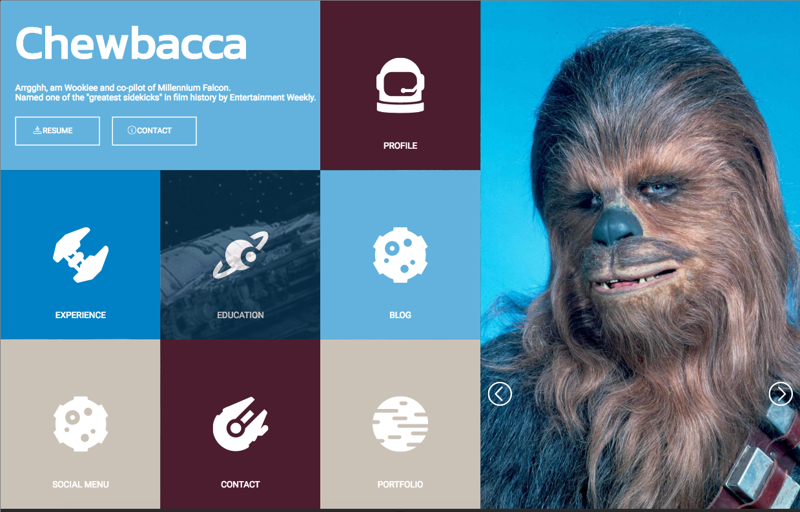
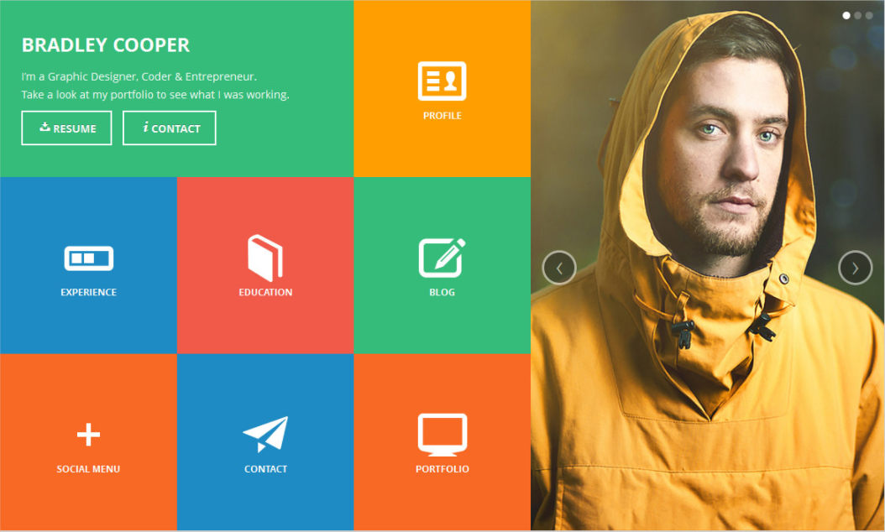

# Static Comp Challenge 1

#### HTML Layout
The layout of Static comp one is a replication of the example comp provided.  First the page was broken down into two main boxes a section holding the smaller info boxes and a large box to contain the main image.  The box container contains the individual `<article>` boxes.  Upon resizing the image for responsiveness the main image box will reposition on top of the box container at 1300x and the image will change.  Further responsive design will transform the font size within all the boxes and the background images as they begin to stack on top of each other finally breaking down to a mobile view.

#### CSS

For the styling of the comp the web application COOLORS was used to determine the color pallette and images were sourced online.  effects were added to the heading box and picture buttons to notify the user of the purpose and a hover effect was placed on the individual boxes.

#### Original Comp

#### Final Comp

